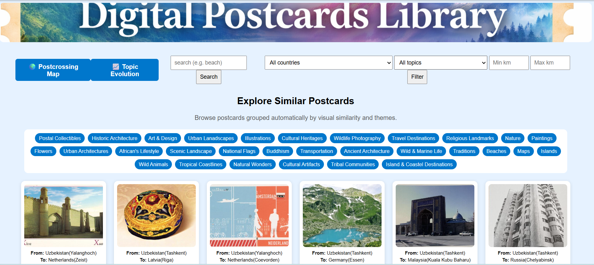

# Digital Postcards Library

A Flask-based digital postcard library that combines computer vision, semantic search, clustering, and geospatial visualization to explore a large collection of historical postcards.

## Application Preview


## Project Overview

This project provides an interactive web application for exploring approximately 10,600 digital postcard images together with their metadata.

The application uses OpenAI CLIP to create image embeddings and enables users to search and explore postcards based on visual and semantic similarity.

## Key Features

-  Semantic image search using CLIP
-  Country-based filtering
-  Geographic visualization of postcard locations
-  Postcard journey and location exploration
-  Image clustering using K-Means
-  Cluster visualization using t-SNE
-  Topic evolution over time
-  Interactive postcard browsing
-  Geographical distance-based exploration

## Technologies Used

- Python
- Flask
- PyTorch
- OpenAI CLIP (ViT-B/32)
- NumPy
- Scikit-learn
- SciPy
- Matplotlib
- Plotly
- Folium
- Geopy
- Pillow
- HTML/CSS

## Machine Learning Approach

The project uses CLIP to transform postcard images into numerical feature representations.

These embeddings are then used for:

1. Semantic similarity search
2. K-Means clustering
3. Cosine similarity analysis
4. t-SNE visualization

The clustering component groups visually and semantically similar postcards to support exploration of the collection.

## Application Structure

```text
digital-postcards-library/
│
├── main.py
├── search.py
├── cluster.py
├── image_features.py
├── gen_coords.py
├── generate_country_centers.py
│
├── data.json
├── location_coords.json
├── country_centers.json
│
├── static/
│   └── Images/
│
├── templates/
│   ├── index.html
│   ├── clusters.html
│   ├── map.html
│   └── welcome.html
│
├── README.md
├── Requirements.txt
└── .gitignore

## Dataset
## Dataset

The original project contains approximately 10,600 postcard images and associated metadata.

The postcard image collection and large generated feature files are not included in this public GitHub repository because of their size and dataset/distribution considerations.

### Running the Application

The current GitHub repository is intended primarily for portfolio and code review purposes.

The complete original dataset and generated feature files are required to run the application with the full postcard collection, but they are not included in this public repository.

The application can therefore be reviewed through the source code, project documentation, and application screenshots provided in this repository.

## Project Background
This project was independently designed and developed as part of an academic project.

The project requirements were provided by the university, while the implementation, machine learning workflow, data processing, web application, and interactive visualizations were developed by me.

The project has now been reorganized and documented as a portfolio project to demonstrate practical experience with Python, machine learning, computer vision, semantic search, clustering, and geospatial data visualization.

## Author
**Meera Sahib Fathima Rinosa**

## Copyright
© 2026 Meera Sahib Fathima Rinosa. All rights reserved.
This repository is provided for portfolio and educational review purposes.
No permission is granted to reproduce, distribute, modify, or commercially use the source code without prior written permission.